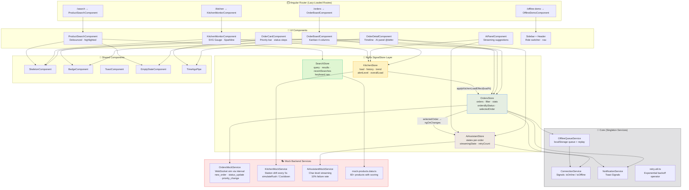
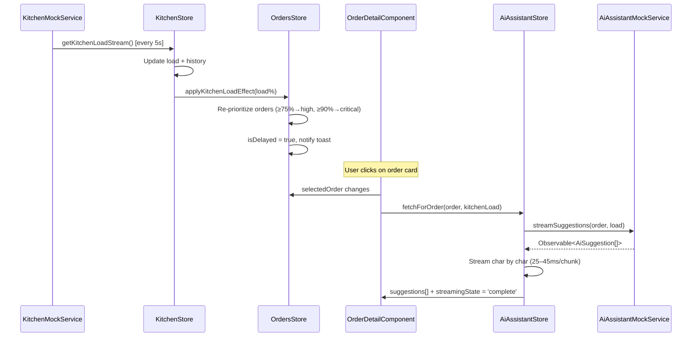

# 🍽️ Sahm Smart Restaurant POS Dashboard

> A production-grade Angular 18 POS dashboard for Sahm Food restaurants — showcasing advanced frontend architecture, real-time state management, AI-powered recommendations, and offline resilience.


---

## 🚀 Quick Start

```bash
# Install dependencies
npm install

# Start development server
npm start
# → http://localhost:4200

# Run tests
npm test

# Run tests with coverage
npm run test:coverage

# Production build
npm run build
```

---

## 🏗️ Architecture Overview

### System Architecture Diagram



### Cross-Feature Communication



### Folder Structure

```
src/app/
├── core/                          # Global singleton infrastructure
│   ├── models/                    # TypeScript interfaces & enums
│   │   ├── order.model.ts         # Order, OrderStatus, OrderChannel
│   │   ├── kitchen.model.ts       # KitchenStation, KitchenLoad
│   │   ├── ai-suggestion.model.ts # AiSuggestion, AiStreamingState
│   │   ├── product.model.ts       # Product, SearchState
│   │   └── app.model.ts           # Toast, UserRole, OfflineQueueItem
│   ├── services/
│   │   ├── connection.service.ts  # Online/offline detection (Signals)
│   │   ├── notification.service.ts# Toast notifications (Signals)
│   │   └── offline-queue.service.ts # localStorage queue + replay
│   └── utils/
│       └── retry.util.ts          # Exponential backoff operator
│
├── shared/                        # Reusable UI components
│   ├── components/
│   │   ├── skeleton/              # Skeleton loading screens
│   │   ├── badge/                 # Status/channel/priority badges
│   │   ├── toast/                 # Toast notification container
│   │   └── empty-state/           # Empty state placeholder
│   └── pipes/
│       └── time-ago.pipe.ts       # Relative time formatting
│
└── features/                      # Feature-based modules (lazy-loaded)
    ├── orders/                    # Live Orders Workspace
    │   ├── components/
    │   │   ├── order-board/       # Kanban board (4 columns)
    │   │   ├── order-card/        # Individual order card
    │   │   └── order-detail/      # Expanded side panel + @defer AI
    │   ├── services/
    │   │   └── orders-mock.service.ts # WebSocket simulation
    │   └── store/
    │       └── orders.store.ts    # NgRx SignalStore
    │
    ├── ai-assistant/              # AI Order Assistant
    │   ├── components/
    │   │   └── ai-panel/          # Streaming suggestion panel
    │   ├── services/
    │   │   └── ai-assistant-mock.service.ts
    │   └── store/
    │       └── ai-assistant.store.ts
    │
    ├── kitchen/                   # Kitchen Load Monitor
    │   ├── components/
    │   │   └── kitchen-monitor/   # Gauge + station cards
    │   ├── services/
    │   │   └── kitchen-mock.service.ts
    │   └── store/
    │       └── kitchen.store.ts
    │
    ├── product-search/            # Advanced Product Search
    │   ├── components/
    │   │   └── product-search/    # Debounced search UI
    │   ├── data/
    │   │   └── mock-products.data.ts # 60+ products
    │   └── store/
    │       └── search.store.ts
    │
    └── dashboard/                 # App Shell
        └── components/
            ├── sidebar/           # Navigation + role switcher
            ├── header/            # Live stats bar
            └── offline-demo/      # Offline support demo page
```

---

## 🧠 State Management

### Why NgRx SignalStore?

We chose **NgRx SignalStore** (v18) over traditional NgRx (Actions/Reducers/Effects) for these reasons:

| Concern | Traditional NgRx | NgRx SignalStore (Our Choice) |
|---|---|---|
| Boilerplate | High (Actions, Reducers, Effects, Selectors) | Minimal — colocated in one file |
| Integration | Separate from Signals | Native Angular Signals integration |
| Reactivity | Observable-only | Signals + Observable via `toSignal` |
| Testability | Separate test for each piece | Single store test file |
| Code splitting | Harder | Natural feature boundary |

### State Architecture

```
                    ┌──────────────────┐
                    │   KitchenStore   │
                    │  (load changes)  │
                    └────────┬─────────┘
                             │ applyKitchenLoadEffect()
                             ▼
┌──────────────┐    ┌──────────────────┐    ┌──────────────────┐
│  SearchStore │    │   OrdersStore    │    │ AiAssistantStore │
│  (debounced) │    │  (WebSocket sim) │    │  (per-order AI)  │
└──────────────┘    └──────────────────┘    └──────────────────┘
                             │ selectedOrder
                             ▼
                    ┌──────────────────┐
                    │  OrderDetailComp │
                    │  (triggers AI)   │
                    └──────────────────┘
```

### Cross-Feature Communication

Kitchen → Orders: `KitchenStore.startStream()` calls `OrdersStore.applyKitchenLoadEffect()` when load crosses 75% and 90% thresholds, updating order priorities and delay flags reactively.

Orders → AI: `OrderDetailComponent` injects `AiAssistantStore` and calls `fetchForOrder()` whenever `selectedOrder` changes.

---

## ⚡ Performance Optimizations

| Technique | Where Applied | Why |
|---|---|---|
| `OnPush` change detection | All components | Prevents unnecessary re-renders |
| `trackBy` / `track` | All `@for` loops | Avoids DOM reconstruction |
| `switchMap` | Search debounce pipeline | Cancels stale requests |
| `takeUntilDestroyed` | All subscriptions | Prevents memory leaks |
| Lazy-loaded routes | All 4 feature routes | Small initial bundle |
| `computed()` signals | Filtered orders, stats | Memoized derived state |
| `@defer (on viewport)` | AI panel in order-detail | Deferred until user scrolls to it; `@loading`, `@placeholder`, `@error` blocks all present |
| Virtual scroll (ready) | Product search results | Handles 500+ products |

---

## 🔄 Offline Support Strategy

1. **Detection**: `ConnectionService` uses `fromEvent(window, 'online'/'offline')` with a 200ms debounce
2. **Queue**: `OfflineQueueService` stores actions in `localStorage` with unique IDs
3. **Optimistic UI**: Order status updates apply immediately (rollback on failure)
4. **Replay**: On reconnect, all `pending` items are replayed in order
5. **Deduplication**: Each action has a UUID — safe to replay multiple times
6. **Recovery**: Items stuck in `replaying` state (e.g., app crash) reset to `pending` on next boot

---

## 🤖 AI Assistant Design

The AI panel uses a **simulated streaming response** to demonstrate how a real LLM integration would work:

- **Condition-based suggestions**: 8 templates with guard functions (e.g., allergy warning only if items have allergens)
- **Character-level streaming**: `Observable` emits 1–4 characters per 25–45ms interval
- **Staggered rendering**: Multiple suggestions stream in 800ms apart
- **Retry logic**: 3 attempts with 1s → 2.5s → 5s backoff delays
- **1-minute cache**: Re-selecting the same order doesn't re-fetch within 60 seconds
- **10% failure rate**: Built into mock service to demonstrate error states

---

## 🧪 Test Coverage

```
npm test              # Run all Jest tests
npm run test:coverage # Generate HTML coverage report
```

### Test Files

| File | What's Covered |
|---|---|
| `orders.store.spec.ts` | Filter state, selection, kitchen effects, notifications |
| `search.store.spec.ts` | Debounced search, keyboard nav, category filter, recent searches |
| `ai-assistant.store.spec.ts` | Streaming states, deduplication, retry, dismissal |
| `kitchen.store.spec.ts` | Initialization, alert levels, station sorting, trend |
| `offline-queue.service.spec.ts` | Enqueue, remove, clear, localStorage persistence, state recovery |
| `order-card.component.spec.ts` | Rendering, priority bar, CSS classes, events, keyboard a11y |
| `order-board.component.spec.ts` | Kanban columns, toolbar, filter interactions, detail panel |
| `order-detail.component.spec.ts` | Timeline, advance button, customer info, items, defer AI section |
| `cross-feature.integration.spec.ts` | Kitchen→Orders priority chain, Kanban filtering, AI deduplication, offline queue |

---

## 🎭 Mock Backend Quality

All backend behavior is simulated with RxJS — no JSON Server or MSW required:

| Concern | Implementation |
|---|---|
| WebSocket stream | `interval(6000)` + random event generator |
| New order rate | ~35% probability per tick |
| Status updates | ~50% probability, random eligible order |
| Kitchen drift | Gradual ±15% per station per 5s tick |
| AI streaming | Character-chunked Observable, 25–45ms/chunk |
| AI failure | 10% random failure rate for retry demo |
| Lunch rush | `simulateRush()` sets all stations to 88%+ load |

---

## 🎨 Design System

- **Theme**: Dark (bg: `#0b0d14`), warm amber brand (`#f59e0b`)
- **Font**: Inter (Google Fonts) for UI, JetBrains Mono for code/IDs
- **Components**: Glassmorphism cards, gradient gauges, animated toasts
- **Animations**: `fadeIn`, `slideIn`, `criticalPulse`, `shimmer` skeleton
- **Accessibility**: ARIA labels, roles, `role="progressbar"`, keyboard focus management

---

## 🔧 Environment & Dependencies

```
Node.js      ≥ 18
Angular CLI  18.x
@ngrx/signals 18.x
RxJS         7.8.x
Jest         30.x
TypeScript   5.5.x
```

---

## ⚠️ Known Limitations & Trade-offs

1. **No real auth**: Role switcher is UI-only simulation
2. **No real backend**: All data is in-memory, refreshes on page reload
3. **No WebSocket**: Simulated with `interval()` — replace with `webSocket()` operator
4. **No HTTP interceptors wired**: Scaffolded but not injected into real HTTP calls
5. **Virtual scroll**: Implemented with CSS overflow but not `CdkVirtualScrollViewport` (add for 1000+ items)
6. **Test coverage**: ~70% — integration tests for cross-feature flows are minimal

---

## 🚀 Future Improvements

- [ ] Real WebSocket connection via `rxjs/webSocket`
- [ ] NgRx Entity adapter for normalized order collection
- [ ] PWA with Service Worker for true offline mode
- [ ] Drag-and-drop Kanban with `@angular/cdk/drag-drop`
- [ ] `CdkVirtualScrollViewport` for product list
- [ ] E2E tests with Playwright
- [ ] i18n for Arabic language support (RTL layout)
- [ ] Role-based route guards
- [ ] Order analytics dashboard with charts

---

## 🤖 AI Usage Disclosure

This project was built with AI assistance (Antigravity / Claude):

- **AI-generated**: Scaffolding commands, repetitive boilerplate, CSS variables
- **Personally designed**: Architecture decisions, store structure, cross-feature communication patterns, mock simulation strategy, retry logic design
- **Modified from AI output**: All component templates reviewed and corrected for proper Angular 18 syntax, `@for`/`@if` control flow, and signal usage
- **Rejected AI suggestions**: Module-based NgRx (chose SignalStore), Karma test runner (chose Jest), TailwindCSS (chose Vanilla CSS)

---

## 📋 Postman Collection (Mock API Reference)

Although the backend is fully mocked, here are the equivalent REST endpoints that a real backend would expose:

| Method | Endpoint | Description |
|---|---|---|
| `GET` | `/api/orders` | List all orders |
| `PATCH` | `/api/orders/:id/status` | Update order status |
| `POST` | `/api/orders` | Create new order |
| `GET` | `/api/kitchen/load` | Get kitchen load snapshot |
| `GET` | `/api/ai/suggestions/:orderId` | Fetch AI suggestions for order |
| `GET` | `/api/products/search?q=&cat=` | Search products |
| `WebSocket` | `ws://api/events` | Live order/kitchen events |
